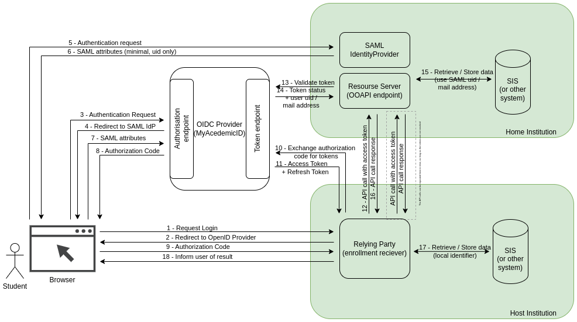

# OpenID Connect in eduXchange.eu

In the eduXchange enrollment usecase, MyAcademicID is used as an OpenID connect
provider, responsible for authenticating the user and managing the tokens.
The enrollment receiver is a Relying party, and the OOAPI endpoint is a
Resource Server.

