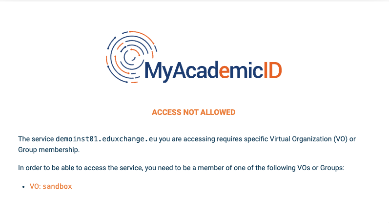

# Testing

When logging in to MyAcademicID during testing, access is only allowed for
accounts that are a member of the Virtual Organization `sandbox`. In the
access denied screen, there is a link (`VO: sandbox`) to become a member of
this team. After joining the team, start the registration flow again.

